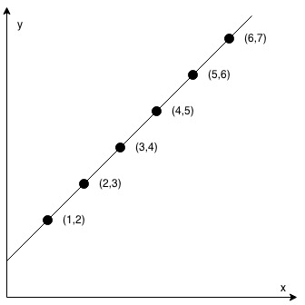
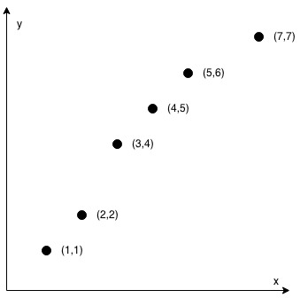

##1232.缀点成线
在一个 XY 坐标系中有一些点，我们用数组 coordinates 来分别记录它们的坐标，其中 coordinates[i] = [x, y] 表示横坐标为 x、纵坐标为 y 的点。

请你来判断，这些点是否在该坐标系中属于同一条直线上，是则返回 true，否则请返回 false。

###示例

    输入：coordinates = [[1,2],[2,3],[3,4],[4,5],[5,6],[6,7]]
    输出：true
    
    输入：coordinates = [[1,1],[2,2],[3,4],[4,5],[5,6],[7,7]]
    输出：false

###思路
    共线向量线性相关
###code
    class Solution {
        public boolean checkStraightLine(int[][] coordinates) {
            int deltaX = coordinates[0][0], deltaY = coordinates[0][1];
            int n = coordinates.length;
            for (int i = 0; i < n; i++) {
                coordinates[i][0] -= deltaX;
                coordinates[i][1] -= deltaY;
            }
            int A = coordinates[1][1], B = -coordinates[1][0];
            for (int i = 2; i < n; i++) {
                int x = coordinates[i][0], y = coordinates[i][1];
                if (A * x + B * y != 0) {
                    return false;
                }
            }
            return true;
        }
    }
