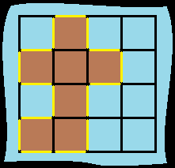

##463. 岛屿的周长
给定一个 row x col 的二维网格地图 grid ，其中：grid[i][j] = 1 表示陆地， grid[i][j] = 0 表示水域。

网格中的格子 水平和垂直 方向相连（对角线方向不相连）。整个网格被水完全包围，但其中恰好有一个岛屿（或者说，一个或多个表示陆地的格子相连组成的岛屿）。

岛屿中没有“湖”（“湖” 指水域在岛屿内部且不和岛屿周围的水相连）。格子是边长为 1 的正方形。网格为长方形，且宽度和高度均不超过 100 。计算这个岛屿的周长。

###示例

    输入：grid = [[0,1,0,0],[1,1,1,0],[0,1,0,0],[1,1,0,0]]
    输出：16
    解释：它的周长是上面图片中的 16 个黄色的边
    
    输入：grid = [[1]]
    输出：4

    输入：grid = [[1,0]]
    输出：4
###思路
    每个岛正常的周长为4；但若与其它岛相连，那么周长就要减二。
    如：两个岛不相连为 2 * 4 =8；若相连则为 (2 * 4) - (n * 2)，n为相邻的边数；
    则问题转化为求岛的总数以及相邻边的数量；
    每个岛都只负责自己有没有与后面和下面相邻，若有则边数加1；
    特殊情况：最后和最下面的岛不用计算相邻边数；
    
    时间复杂度：O(mn)
    空间复杂度：O(1)
    
###code
    class Solution {
        public int islandPerimeter(int[][] grid) {
            int totolCount = 0;
            int sideCount = 0;
            int width = grid.length;
            int hight = grid[0].length;
            for(int x = 0; x < width; x++){
                for(int y =0; y < hight; y++){
                    if(grid[x][y] == 1){
                        totolCount ++;
                        if(x < width -1){
                            if(grid[x + 1][y] == 1){
                                sideCount++;
                            }
                        }
                        if(y < hight -1){
                            if(grid[x][y+1] == 1){
                                sideCount++;
                            }
                        }
                    }
                }
            }
            return totolCount * 4 - sideCount * 2;
        }
    }