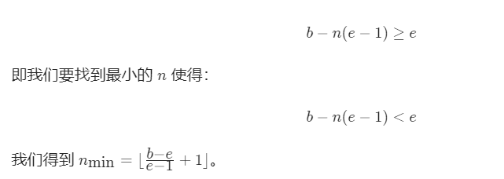

##1518.换酒问题

###示例

###思路
    第一步，首先我们一定可以喝到 bb 瓶酒，剩下 bb 个空瓶。
    
    第二步，接下来我们来考虑空瓶换酒，换完再喝，喝完再换的过程——每次换到一瓶酒就意味着多一个空瓶，所以每次损失的瓶子的数量为 e - 1e−1，我们要知道这个过程能得到多少瓶酒，即希望知道第一个打破下面这个条件的 nn 是多少：
    
    b - n(e - 1) \geq e
    b−n(e−1)≥e
    
    即我们要找到最小的 nn 使得：
    
    
    当然我们要特别注意这里的前提条件是 b \geq eb≥e，试想如果 b < eb<e，没有足够的瓶子再换酒了，就不能进行第二步了。
    
###code
    class Solution {
        public int numWaterBottles(int numBottles, int numExchange) {
            //数学方法
            return numBottles >= numExchange ? (numBottles - numExchange) / (numExchange - 1) + 1 + numBottles : numBottles;
        }
    }
    
    class Solution {
        public int numWaterBottles(int numBottles, int numExchange) {
            int bottle = numBottles, ans = numBottles;
            while (bottle >= numExchange) {
                bottle -= numExchange;
                ++ans;
                ++bottle;
            }
            return ans;
        }
    }
    
    