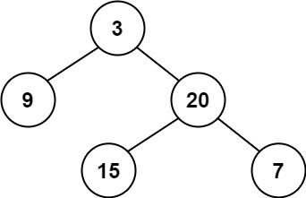
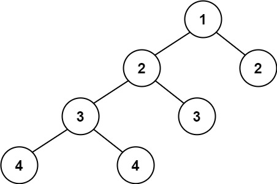

##110. 平衡二叉树
给定一个二叉树，判断它是否是高度平衡的二叉树。

本题中，一棵高度平衡二叉树定义为：

一个二叉树每个节点 的左右两个子树的高度差的绝对值不超过 1 

###示例
    输入：root = [3,9,20,null,null,15,7]
    输出：true
    
    输入：root = [1,2,2,3,3,null,null,4,4]
    输出：false
    
    输入：root = []
    输出：true
###思路
    1.对二叉树做先序遍历，从底至顶返回子树最大高度，若判定某子树不是平衡树则 “剪枝” ，直接向上返回
    2.
###code
    /**
     * Definition for a binary tree node.
     * public class TreeNode {
     *     int val;
     *     TreeNode left;
     *     TreeNode right;
     *     TreeNode() {}
     *     TreeNode(int val) { this.val = val; }
     *     TreeNode(int val, TreeNode left, TreeNode right) {
     *         this.val = val;
     *         this.left = left;
     *         this.right = right;
     *     }
     * }
     */
    class Solution {
        public boolean isBalanced(TreeNode root) {
            return recur(root) != -1;
        }
        private int recur(TreeNode root){
            if(root == null) return 0;
            int left = recur(root.left);
            if(left == -1)return -1;
            int right = recur(root.right);
            if(right == -1)return -1;
            return Math.abs(left - right)<2?Math.max(left,right)+1 : -1;
        }
    }